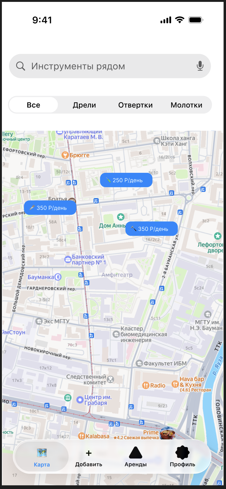
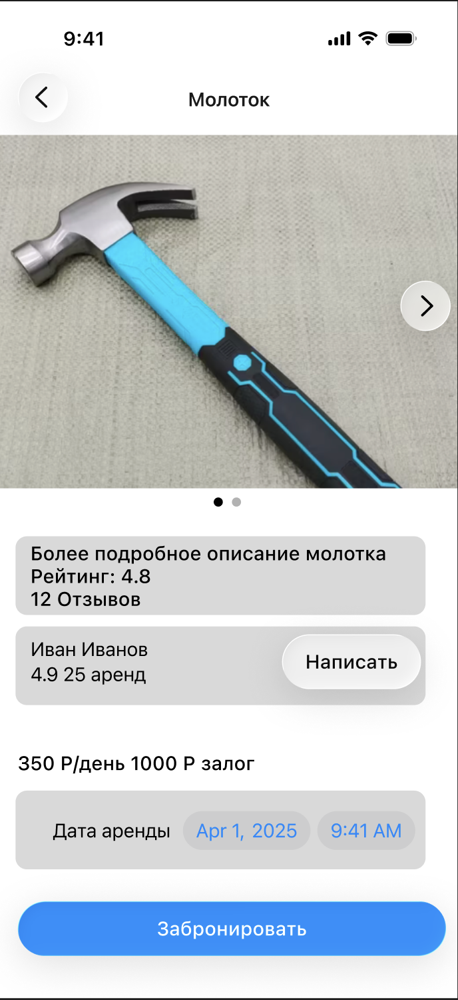
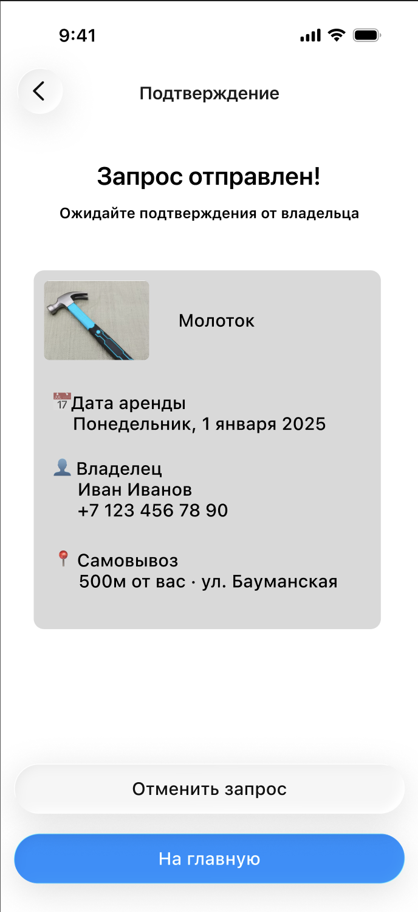

# ToolShare - Системный анализ и проектирование

[На главную](../README.md)

---

## DDD - Доменные зоны

### 1. Поиск (Search)

Все, что связано с нахождением инструмента поблизости.

| Термин | Определение |
|--------|-------------|
| Listing | Объявление об инструменте, размещенное арендодателем |
| Location | Географические координаты объявления |
| Filter | Набор параметров для сужения результатов поиска (тип, дата, расстояние) |
| Cluster | Группа объявлений на карте, объединенных из-за близкого расположения |
| Radius | Радиус поиска инструмента вокруг пользователя |

---

### 2. Бронирование (Booking)

Все, что связано с резервированием инструмента и управлением датами.

| Термин | Определение |
|--------|-------------|
| Reservation | Подтвержденная запись аренды инструмента на конкретные даты |
| Slot | Временной интервал, доступный для бронирования |
| Availability | Список свободных слотов инструмента на выбранную дату |
| Request | Запрос на бронирование, ожидающий подтверждения арендодателя |
| Cancellation | Отмена активного бронирования |

---

### 3. Пользователи (Users)

Все, что связано с профилями, аутентификацией и репутацией участников платформы.

| Термин | Определение |
|--------|-------------| 
| Renter | Пользователь в роли арендатора - ищет и берет инструмент |
| Owner | Пользователь в роли арендодателя - размещает и сдает инструмент |
| Rating | Числовая оценка пользователя, формируемая на основе отзывов |
| Review | Текстовый отзыв, оставленный после завершения аренды |
| Profile | Публичная страница пользователя с историей и рейтингом |

---

### 4. Объявления (Listings)

Все, что связано с размещением и управлением объявлениями об инструменте.

| Термин | Определение |
|--------|-------------|
| Tool | Единица инструмента, выставленная на аренду |
| Category | Тип инструмента (дрель, перфоратор, болгарка и т.д.) |
| Price | Стоимость аренды за сутки |
| Deposit | Залог, возвращаемый арендатору после завершения аренды без ущерба |
| Photo | Фотография инструмента, загружаемая арендодателем |

---

### 5. Поддержка (Support)

Все, что связано с разрешением споров и помощью пользователям.

| Термин | Определение |
|--------|-------------|
| Issue | Обращение пользователя в службу поддержки |
| Dispute | Спор между арендатором и арендодателем по итогам аренды |
| Resolution | Решение поддержки по итогам разбора спора |
| Complaint | Жалоба на действия другого пользователя |

---

## BDD - Критический путь

**Критический путь:** арендатор находит инструмент на карте и бронирует его.

### Сценарий успеха

```
Дано:
  пользователь открыл карту в приложении
  И на карте есть объявление о молотке в радиусе 2 км
  И выбранная дата свободна у этого инструмента

Когда:
  он тапает на пин объявления
  И нажимает кнопку "Забронировать"
  И подтверждает выбранную дату и продолжительность брони

Тогда:
  бронирование переходит в статус "Ожидает подтверждения"
  арендодатель получает уведомление о новом запросе
  пользователь видит экран подтверждения с датой и контактами арендодателя
  выбранная дата помечается как недоступная для других пользователей
```

### Сценарий отказа

```
Дано:
  пользователь открыл карточку объявления о молотке
  И выбранная дата отображается как свободная
  И в момент подтверждения эту дату занял другой пользователь

Когда:
  он нажимает кнопку "Забронировать"
  И подтверждает выбранную дату и продолжительность брони

Тогда:
  система показывает ошибку "Инструмент уже забронирован на эту дату"
  бронирование не создается
  выбранная дата помечается как недоступная в календаре
  пользователь остается на экране карточки и может выбрать другую дату
```

---

## Wireframes - Ключевые экраны

### Экран 1: Карта



### Экран 2: Карточка инструмента



### Экран 3: Подтверждение брони



---

## API-First - JSON-контракты

### GET /v1/listings/{id}

Получить детальную информацию об объявлении.

**Запрос:**
```
GET /v1/listings/67
```

**Ответ 200 OK:**
```json
{
  "id": 67,
  "title": "Молоток",
  "category": "hammer",
  "description": "Обычный молоток",
  "price_per_day": 350,
  "deposit": 1000,
  "photos": [
    "https://toolshare.ru/images/67/photo1.jpg",
    "https://toolshare.ru/images/67/photo2.jpg"
  ],
  "owner": {
    "id": 7,
    "name": "Иван",
    "rating": 4.9,
    "reviews_count": 25
  },
  "location": {
    "lat": 55.751244,
    "lon": 37.618423,
    "distance_m": 500
  }
}
```

**Ответ 404 Not Found:**
```json
{
  "error": "LISTING_NOT_FOUND",
  "message": "Объявление не найдено или удалено"
}
```

---

### POST /v1/reservations

Создать запрос на бронирование.

**Запрос:**
```json
{
  "listing_id": 67,
  "date": "2026-05-15",
  "days": 2
}
```

**Ответ 201 Created:**
```json
{
  "reservation_id": 123,
  "status": "pending",
  "listing_id": 67,
  "date": "2026-05-15",
  "days": 2,
  "total_price": 500,
  "owner_contact": "+7 123 456 78 90"
}
```

**Ответ 409 Conflict:**
```json
{
  "error": "SLOT_UNAVAILABLE",
  "message": "Инструмент уже забронирован на эту дату"
}
```

**Ответ 400 Bad Request:**
```json
{
  "error": "INVALID_PARAMS",
  "message": "Количество дней должно быть больше нуля"
}
```
