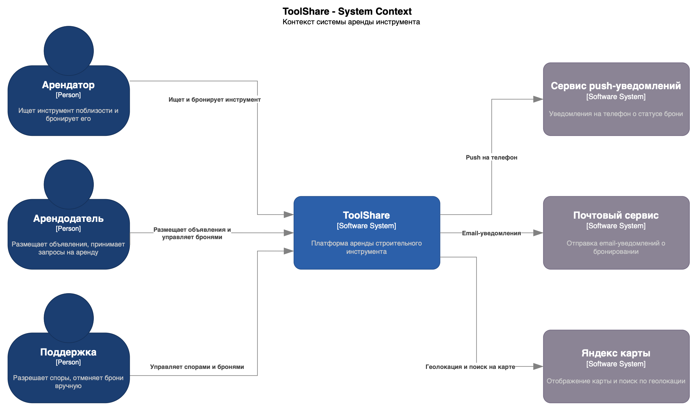
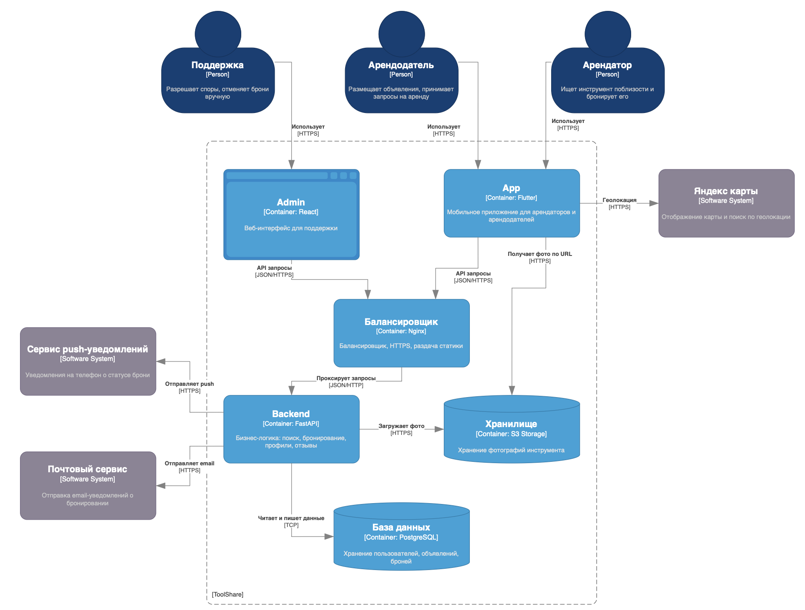

# ToolShare - Архитектура и стек

[На главную](../README.md)

---

## C4 - Уровень 1: Контекст

---

## C4 - Уровень 2: Контейнеры

---

## Стек технологий

### Мобильное приложение - Flutter

Flutter позволяет написать один код для iOS и Android. Для MVP это критично - не нужно держать двух нативных разработчиков.

### Веб-админка - React

Поддержка работает за компьютером, нужен полноценный веб-интерфейс с таблицами, фильтрами и деталями сделок. Для таких задач подходит React.

### Бэкенд - Python (FastAPI)

Python выбран для MVP из-за скорости разработки - меньше кода, быстрее итерации. FastAPI выбран потому что поддерживает асинхронность из коробки.

### База данных - PostgreSQL

Все данные реляционные: пользователи, объявления, брони, отзывы - с чёткими связями между собой. PostgreSQL - стандарт индустрии для таких задач.

### Хранение файлов - S3 Storage

Фотографии инструмента занимают много места и постоянно растут. Хранить их на сервере вместе с кодом неудобно - диск забьётся, резервное копирование усложнится. S3 - отдельное хранилище под файлы, клиент получает фото напрямую по URL без нагрузки на бэкенд.

### Балансировщик - Nginx

Стандарт индустрии. Буферизует медленных клиентов, не блокируя бэкенд, раздаёт HTTPS, кеширует статичные ответы.
